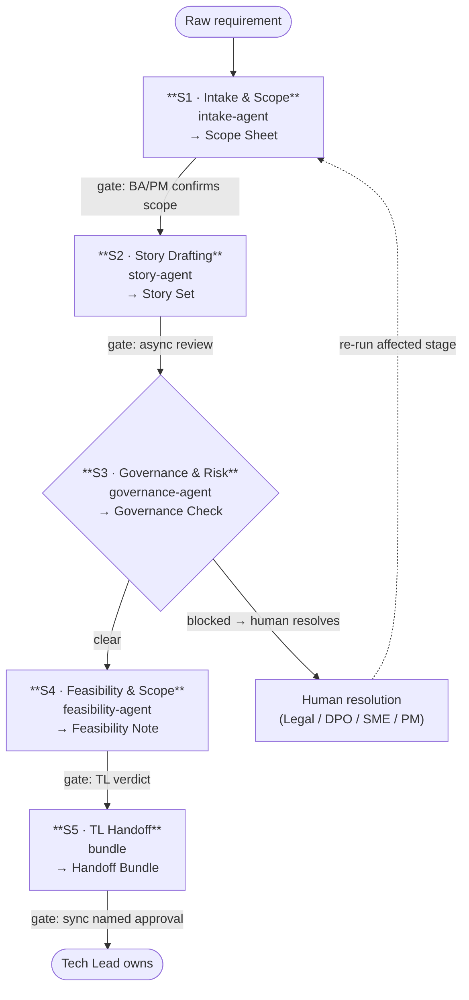
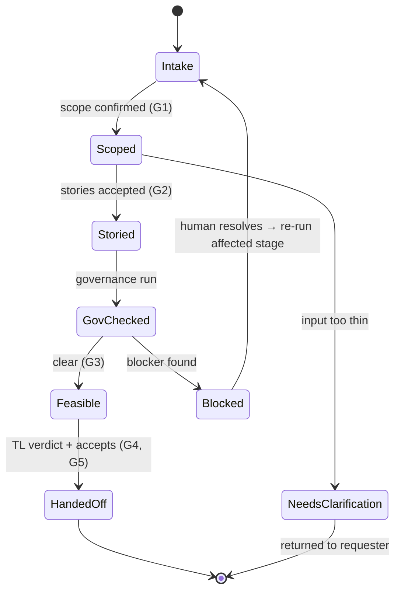

# Agentic Business Workflow — BA Requirement → TL Handoff

> **What this is.** A supervision design (produced with the `agentic-workflow-design` skill) for a **fresh,
> lightweight agentic BA pipeline**: it turns a raw business requirement into a Tech-Lead-ready handoff through
> five agent stages, each with one input, one output contract, one approval gate, and one accountable human owner.
> This artifact *recommends and records* how the pipeline is supervised — it does **not** run or operate it.
>
> **How to read this package.**
> - This file = the overview (the whole flow at a glance).
> - [`handoff-contracts.md`](./handoff-contracts.md) = the exact fields each stage emits + the final bundle.
> - [`governance-and-gates.md`](./governance-and-gates.md) = gates, command-safety, accountability, observability.
> - [`worked-example-shoppilot.md`](./worked-example-shoppilot.md) = the whole flow run on a real requirement.
> - [`diagrams/`](./diagrams/) = editable pipeline + state-machine diagrams.

---

## Goal & autonomy level

- **What it does:** ingest a raw requirement (Jira / email / meeting notes / doc), and produce a TL-ready handoff —
  scoped, written as user stories, governance-checked, and feasibility-assessed.
- **Autonomy:** **L2–L3 assist** (agents draft; humans decide). **Human-in-the-loop (HITL)** — a named human
  approves every gate. No stage decides, commits, or hands off on its own.
- **Accountable owner of record:** the **Tech Lead** for the final handoff; the **BA lead** for stages 1–3.
  Agents draft; humans own.

---

## The flow at a glance

**Reading a box:** `input → agent → output contract → gate → owner`. Stage 3 is the only branch: `clear` continues,
`blocked` loops back through a human before re-running. Nothing reaches the TL while a blocker is open.

---

## Pipeline stages

| # | Stage (agent) | Input | Output contract | Gate | Owner | Could be implemented by |
|---|---------------|-------|-----------------|------|-------|-------------------------|
| 1 | **Intake & Scope** (`intake-agent`) | raw requirement | **Scope Sheet** — goal, in-scope, out-of-scope, NFRs, open questions, confidence | async review → **BA/PM confirms scope** | BA | `requirement-analysis` skill |
| 2 | **Story Drafting** (`story-agent`) | Scope Sheet | **Story Set** — epic + user stories (As-a / I-want / So-that, business rules, acceptance criteria, out-of-scope) | async review | BA | `references/user-story-template.md` |
| 3 | **Governance & Risk** (`governance-agent`) | Story Set | **Governance Check** — PII flags, compliance flags, blockers, verdict `clear \| blocked` | **`blocked` → sync human resolves**, loops back to S1/S2 | BA + named SMEs | `analyzing-banking-requirements` (light) |
| 4 | **Feasibility & Scope** (`feasibility-agent`) | Story Set + Governance Check + raw req | **Feasibility Note** — ≥2 options, dependencies, risks, verdict `buildable \| not-now \| phased` | async review → **TL verdict** | TL | `technical-feasibility` skill |
| 5 | **TL Handoff** (bundle) | all of the above | **Handoff Bundle** — raw requirement + Scope Sheet + Story Set + Governance Check + Feasibility Note | **sync named approval — TL accepts & becomes owner of record** | TL | (composition step) |

Three design choices, made deliberately:
- **The raw requirement travels to the TL** in the Stage-5 bundle — not just the BA's distilled contract — so the
  TL can re-derive scope and check nothing was lost in translation.
- **Feasibility (Stage 4) sets scope** *before* engineering commits, surfacing options and risks up front.
- **Surface, don't repair.** Stage 3 *flags* governance/compliance gaps as blockers; an agent never silently fixes
  them. Blockers loop back to a named human, who resolves them, then the affected stage re-runs.

---

## Topology

**Single linear pipeline + one human loop-back** (Stage 3 on `blocked`). One agent per stage — and that is on
purpose: a BA flow is inherently sequential (you cannot draft stories before scope, or judge feasibility before
stories exist), so there is **no genuine parallelism to exploit**. Adding more agents would add token cost, handoff
surface, and failure vectors for no gain. Each handoff boundary exists only because the *owner changes* (BA → TL at
Stage 4) or the *artifact type changes* (scope → stories → check → feasibility).

---

## Approval gates (by reversibility & blast radius)

Gates are placed where an action is hard to reverse or has downstream blast radius — not uniformly.

| Gate | Action | Reversibility / blast radius | Gate type | Who |
|------|--------|------------------------------|-----------|-----|
| G1 | Confirm scope (S1→S2) | reversible draft, but anchors everything downstream | **sync named** | BA / PM |
| G2 | Accept Story Set (S2→S3) | reversible artifact | async review | BA |
| G3 | Resolve a blocker (S3) | governance/compliance — high blast radius | **sync named** | BA + SME (Legal/DPO/…) |
| G4 | Feasibility verdict (S4→S5) | sets build scope & cost | **sync named** | TL |
| G5 | Accept handoff (S5) | engineering builds on it — irreversible-ish | **sync named** | TL (owner of record) |

Full detail (plus the command-safety policy and accountability map) lives in
[`governance-and-gates.md`](./governance-and-gates.md). In short:

- **Command-safety:** **ALLOW** read input / draft artifact / render diagram (reversible, sandboxed) · **CONFIRM**
  publish the handoff bundle / mark a blocker resolved / write to a shared backlog · **DENY** echo real PII /
  auto-resolve a blocker / write outside `output/` / call a non-allowlisted tool. Enforced **outside the model**,
  at the tool layer — a drifting agent cannot grant itself a denied action.
- **Never-do guardrails (harness-enforced):** never echo real PII (redact `<PII:REDACTED:CLASS=…>`); never silently
  repair a defect; never auto-resolve a blocker; never hand off while a blocker is open; an agent never relaxes a gate.

---

## Handoff contract (shared envelope)

Every stage-to-stage handoff carries the same typed envelope, so any stage (or a human reviewer) can trust what it
receives:

| Field | Meaning |
|-------|---------|
| `task_id` | the requirement id — **the one trace id** that follows the work end to end |
| `intent` | what this stage was asked to produce |
| `state` | the stage's verdict / output type (e.g. `scope-confirmed`, `blocked`, `buildable`) |
| `confidence` | the agent's self-rated confidence (low confidence → escalate to async review) |
| `provenance` | reference back to the raw requirement + the upstream contract |
| `schemaVersion` | the contract version, so a consumer can detect drift |

**Exactly one owner mutates state per stage.** The next stage reads the previous contract; it does not edit it.
Per-stage field tables are in [`handoff-contracts.md`](./handoff-contracts.md).

---

## Accountability & observability (summary)

- **Accountability map:** each stage runs under a **distinct agent identity** (`intake-agent`, `story-agent`,
  `governance-agent`, `feasibility-agent`) tied to a **named human owner of record** — BA lead for S1–S3, TL for
  S4–S5. AI output is never attributed as an accountable co-author; a human always signs.
- **Observability:** one `task_id` (trace id) spans all five stages. Each stage logs **both halves of the loop** —
  the model call *and* the artifact it emitted (the tool effect) — plus the handoff, under that trace id, with the
  **model version** recorded. Reasoning traces are kept as context, not treated as evidence. (Recommended:
  tamper-evident / append-only log, as the worked example's audit posture shows.)

Full tables in [`governance-and-gates.md`](./governance-and-gates.md).

---

## Failure & recovery

- **Transient errors** (a malformed draft, a schema hiccup) → retry the stage with a small, hard cap, then stop.
- **Fundamental gaps** (`blocked`, or input too thin to scope) → **do not retry blindly**: a `blocked` Governance
  Check loops back to a named human who resolves it, then the affected stage re-runs; input too thin →
  `needs-clarification`, returned to the requester.
- **Idempotent re-runs:** re-running a stage with the same `task_id` reproduces the same contract — safe to replay.
- **HITL escalation is the final recovery tier** — when an agent cannot proceed safely, it stops and asks a human;
  it never forces a path through a gate.

---

## Checklist (agentic-workflow-design)

- [x] Each stage maps to an agent/tool and a named human owner
- [x] Topology chosen; every handoff boundary justified (single-agent-per-stage default)
- [x] Gates placed by reversibility / blast radius; irreversible / high-blast actions require sync named approval
- [x] Command-safety policy (allow / confirm / deny) enforced outside the model
- [x] Least agency: agents scoped to one stage; read input vs. publish handoff separated
- [x] Never-do guardrail set defined and harness-enforced
- [x] Pre-execution caps (retry cap; HITL as final tier)
- [x] Observability: model call + tool effect + handoff under one trace id; model version recorded
- [x] Handoff payload is a versioned typed contract; exactly one owner mutates state
- [x] State machine has explicit failure paths + loop-back + HITL escalation
- [x] Accountability map: distinct agent identity → human owner of record

---

## Verdict

**DESIGN READY for human sign-off.** A BA lead and a Tech Lead should review and own this supervision design before
the pipeline is operated. This artifact recommends the workflow; it never runs, deploys, or operates it, and never
relaxes a gate on an agent's behalf.

> **Human sign-off:** ______________________ (BA lead)  ·  ______________________ (Tech Lead)  ·  date __________
