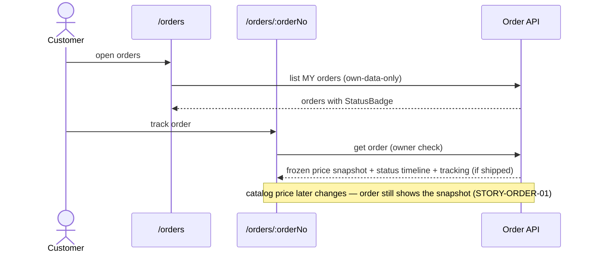

# Flow — Customer Order Tracking

Order list → order detail with frozen price snapshot and status timeline. Own-data-only.

## Screen-by-screen
1. **`/orders`** — list with `order.status.*` badges, `common.action.track_order`; empty → `screen.orders.empty-state`.
2. **`/orders/:orderNo`** — OrderSummary (frozen prices), status timeline, tracking number when `order.status.SHIPPED`; `common.action.back`.

## Edge cases
- Non-owner requests an order number → access denied, **no** order data disclosed (own-data-only authz).
- Catalog price/name changes after purchase → order detail unchanged (snapshot at creation).
- Status advances (admin-driven, STORY-ORDER-02) → new `order.status.*` announced to SR.

## Cross-references
- Screens: `../screens/EPIC-ORDER/stories/STORY-1-customer-tracks-order-frozen-price-snapshot.md`
- States: `../screen-states.md` (`/orders`, `/orders/:orderNo`)
- Note: fulfillment transitions are admin (STORY-ORDER-02) — back-office, no customer screen.
