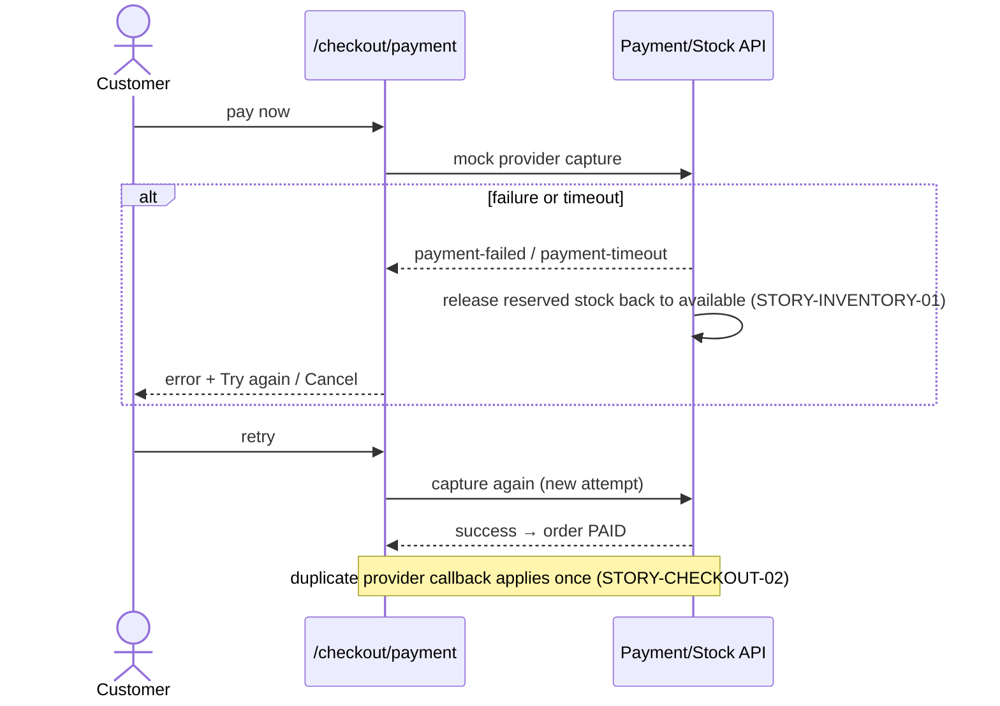

# Flow — Payment Failure / Timeout Recovery

Mock payment fails or times out → reserved stock released → retry or cancel.

## Screen-by-screen
1. **`/checkout/payment` (error)** — `error.payment-declined` or `error.payment-timeout`; `common.action.retry` + `common.action.cancel`.
2. **Retry** — re-attempts capture; on success → `/orders/:orderNo` (PAID).
3. **Cancel / abandon** — reservation already released; order ends payment-failed/timeout; stock available again.

## Edge cases
- TTL (30m) elapses with no payment → reservation auto-releases (STORY-INVENTORY-01).
- Duplicate/late provider callback after retry → applied once; no double settle, no double stock decrement.
- Network drop mid-capture → `error.network`; safe to retry (idempotent on provider event id).

## Cross-references
- Screens: `../screens/EPIC-CHECKOUT/stories/STORY-2-mock-payment-capture-provider-replay-safety.md`
- Happy path: `customer-checkout.md`
- States: `../screen-states.md` (`/checkout/payment`)
