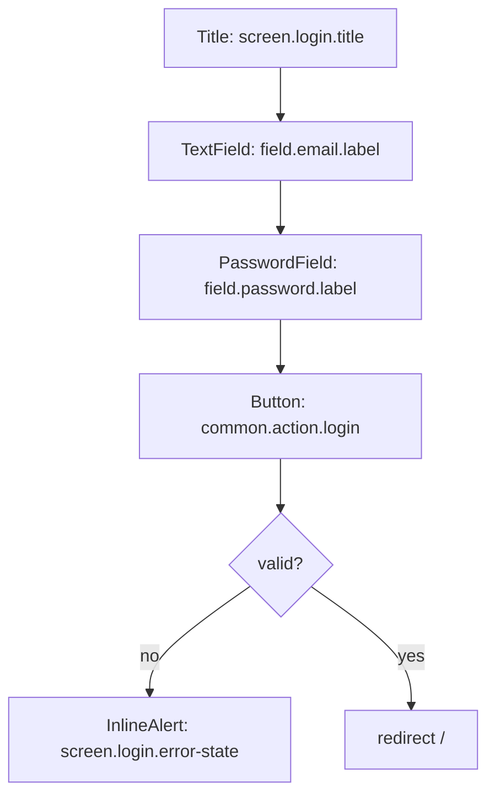

# Customer logs in with email and password

## Layout

## State-by-state
- **Idle / Loading / Error / Success** — see `../../../screen-states.md` (`/login`).
- Error message is **generic** (`screen.login.error-state`) — identical for unknown-email and wrong-password.

## Microcopy keys used
`screen.login.title`, `field.email.label`, `field.email.error-required`, `field.password.label`, `field.password.error-required`, `common.action.login`, `screen.login.error-state`.

## Components
Button, TextField, PasswordField, InlineAlert (`../../../component-inventory.md`).

## Edge cases
- Repeated failures → login rate limiting (BA scope); message unchanged.
- No password/token value ever appears in logs (STORY-AUTH-01 AC).

## Accessibility
Error via `role="alert"`; fields `aria-invalid` + `aria-describedby`. See `../../../accessibility-spec.md`.

## Open questions
- TBD-extract-from-prototype: exact Thai strings and brand styling.
