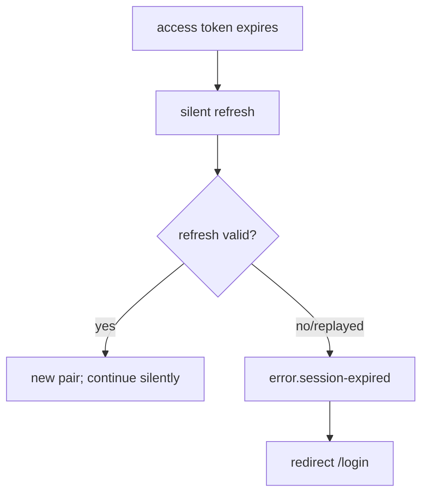

# Customer refreshes an expired session securely

## Layout
No standalone screen — silent refresh in the client/session layer. The only **visible** UX is the
fallback when refresh fails.

## State-by-state
- **Silent success:** no UI; user continues uninterrupted.
- **Failure / replay:** token family revoked → `error.session-expired` → `/login`.

## Microcopy keys used
`error.session-expired`, `common.action.login`.

## Components
InlineAlert (`../../../component-inventory.md`).

## Edge cases
- Replayed refresh token → whole family revoked (STORY-AUTH-02 AC); concurrent refreshes are idempotent (exactly one rotation).

## Accessibility
Session-expiry alert `role="alert"`; focus moves to the login form.

## Open questions
- TBD-confirm-with-UX: whether to show a re-auth modal vs full redirect.
