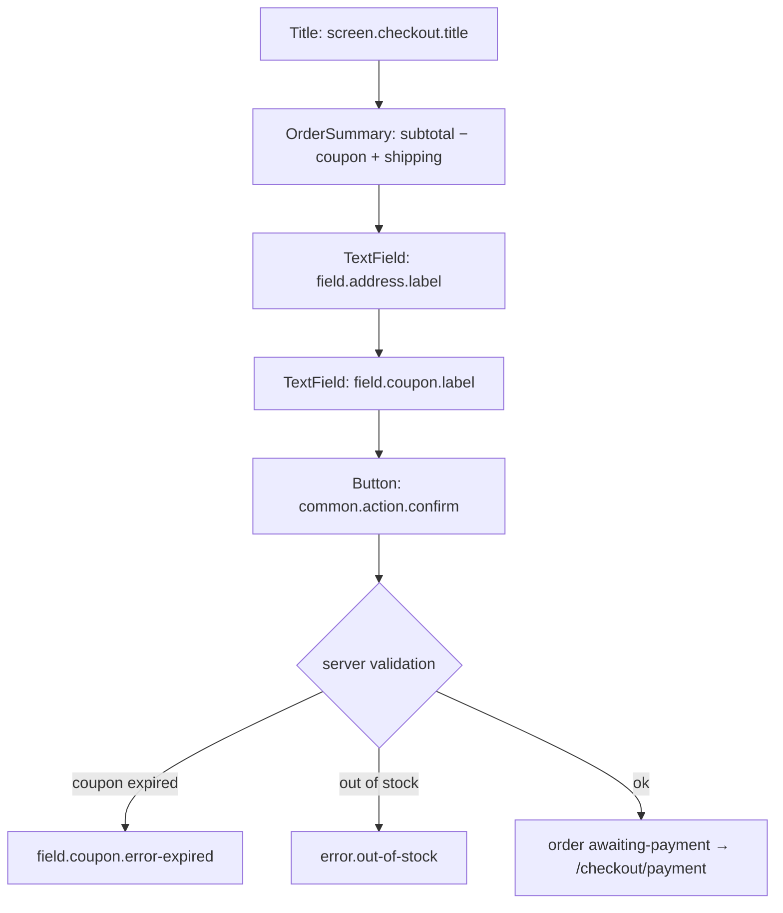

# Customer checks out at a server-computed total

## Layout

## State-by-state
See `../../../screen-states.md` (`/checkout`). Total is **server-computed** (client total never trusted);
coupon re-validated at confirm; confirm is idempotent (duplicate tap → same order).

## Microcopy keys used
`screen.checkout.title`, `field.address.label`, `field.coupon.label`, `field.coupon.error-expired`, `common.action.confirm`, `error.out-of-stock`, `error.validation`.

## Components
OrderSummary, TextField, Button, InlineAlert (`../../../component-inventory.md`).

## Edge cases
- Example: subtotal 1200 + coupon WELCOME100 (−100) + shipping 60 = **1160 THB** (AC).
- Coupon expired during browsing → neutral `field.coupon.error-expired`; no order, no reservation.
- Last-item race → `error.out-of-stock` at confirm.

## Accessibility
OrderSummary total is an `aria-live="polite"` region (recomputation announced). Address is PII —
snapshotted into the order, redacted in non-order logs.

## Open questions
- TBD-extract-from-prototype: Thai strings, brand styling, address sub-field layout.
