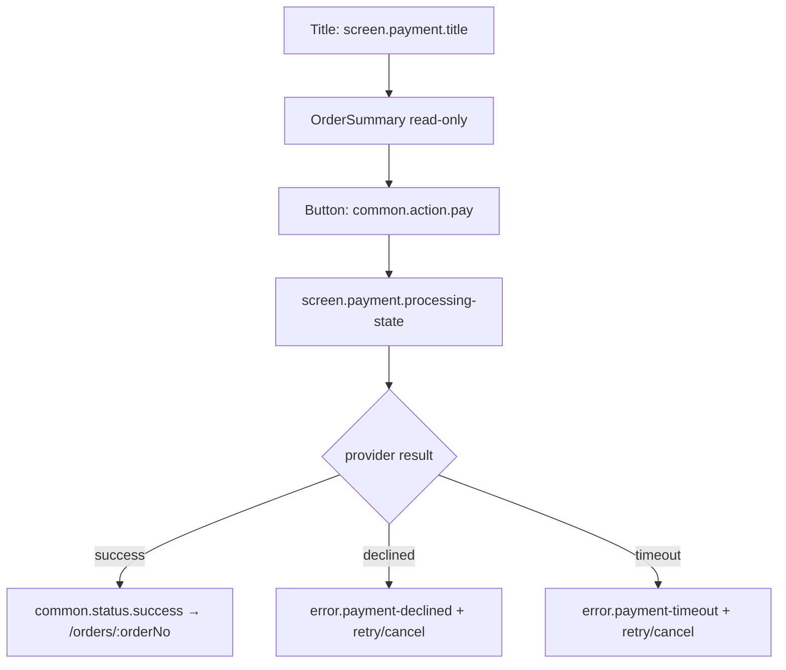

# Mock payment capture with provider-replay safety

## Layout

## State-by-state
See `../../../screen-states.md` (`/checkout/payment`). No card data collected (PSP/mock; PCI scope-excluded).
Duplicate provider callback applies once.

## Microcopy keys used
`screen.payment.title`, `screen.payment.processing-state`, `common.action.pay`, `common.action.retry`, `common.action.cancel`, `error.payment-declined`, `error.payment-timeout`, `common.status.success`.

## Components
OrderSummary, Button, Toast/InlineAlert (`../../../component-inventory.md`).

## Edge cases
- Failure/timeout → reserved stock released (see `../../../flows/payment-failure-recovery.md`).
- Captured amount must equal the server total.
- Late/duplicate callback → applied once (idempotent on provider event id).

## Accessibility
Processing state announced (`aria-live`); failure `role="alert"` (assertive); retry/cancel are 44×44 targets.

## Open questions
- TBD-confirm-with-UX: whether payment is an in-app screen or a PSP-hosted redirect (affects safe-area/back handling).
