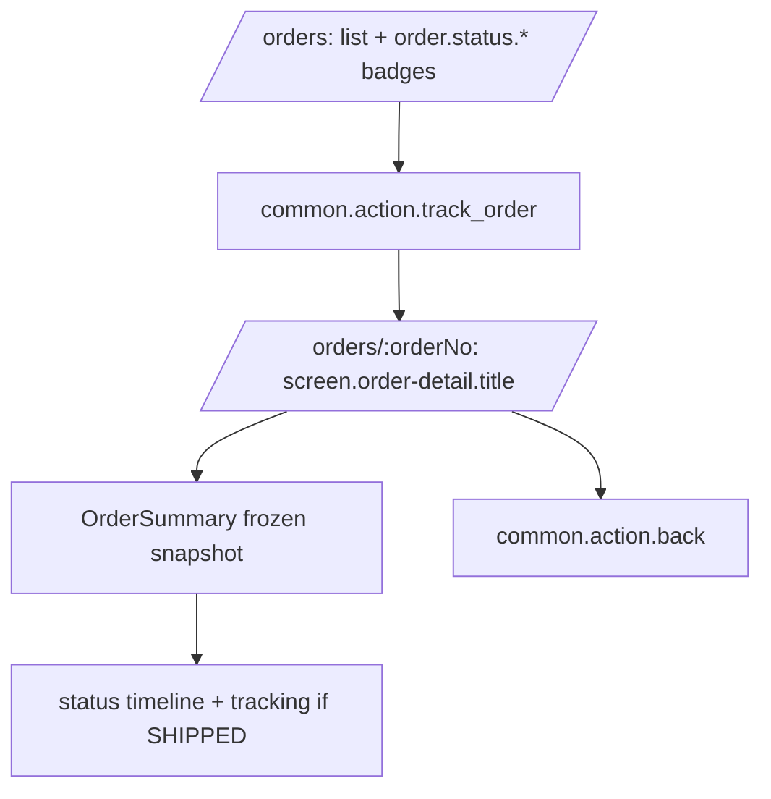

# Customer tracks an order with a frozen price snapshot

## Layout

## State-by-state
See `../../../screen-states.md` (`/orders`, `/orders/:orderNo`). Own-data-only; a non-owner request
is denied with no data disclosed. The order shows the **price snapshot** taken at creation even after
the catalog price changes.

## Microcopy keys used
`screen.orders.title`, `screen.orders.empty-state`, `screen.order-detail.title`, `common.action.track_order`, `common.action.back`, `order.status.AWAITING_PAYMENT`, `order.status.PAID`, `order.status.PACKING`, `order.status.SHIPPED`, `order.status.DELIVERED`, `order.status.CANCELLED`.

## Components
StatusBadge, OrderSummary, Button (`../../../component-inventory.md`).

## Edge cases
- Catalog price changes after purchase → order detail unchanged (snapshot).
- Non-owner → access denied, no order data leaked.
- Status changes are admin-driven (STORY-ORDER-02) and announced to the SR on this screen.

## Accessibility
Status transitions announced; address PII visible to owner/admin only.

## Open questions
- TBD-extract-from-prototype: Thai status labels, timeline visual.
