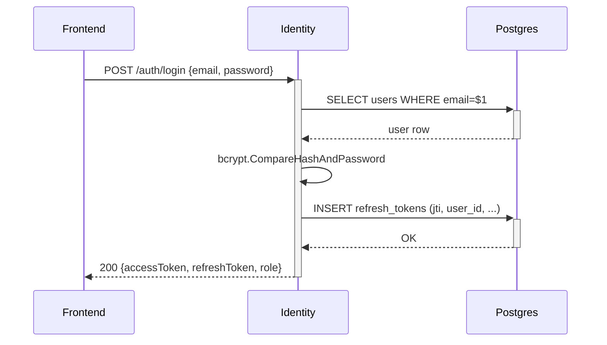
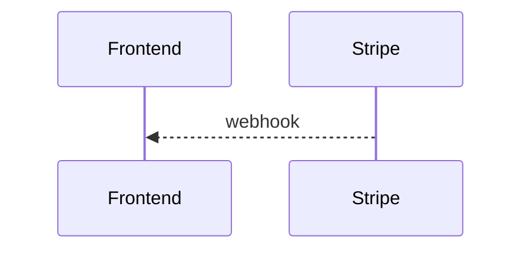

# API Spec Template (TL per-service, scaffold-v1.1 §6.2)

**Owner role:** Tech-Lead (TL adaptation of the base per-API template) · **`template_version`:** 0.1.0

> **TL adaptation (scaffold-v1.1 §6.2).** This skill emits ONE `api-spec.md`
> per service (not per endpoint): a stable, versioned contract whose lifetime
> is years. The per-endpoint section structure below is unchanged from the
> base template; the TL form adds the frontmatter block and **Section 0 —
> Changelog** in front of it. The per-story **L4 spec references this file via
> `api_spec_endpoint_ref`; it never duplicates the contract.**

**File location:** `<workflow_root>/design/architecture/contexts/{ctx}/api-spec.md`

## Frontmatter (TL form)

```yaml
---
artifact_type: tl-api-spec
context_id: <ctx>
related_epic_id: EPIC-<...>
api_style: post-action-based
base_path: /api/v1/platform/<ctx>
api_version: v1
api_version_status: stable
auth_scheme: bearer-jwt-via-kong-plugin
endpoint_count: <int>
last_breaking_change: <date | none>
changelog_entries: <int>
---
```

## Section 0 — Changelog (prepended before the sections below)

Every change to this API's public contract, versioned with the service.
Breaking changes require a version bump (v1 → v2) + migration plan. On a
**first design there is no history — emit exactly one entry**:

```
## Changelog

### v1.0 — <date> (initial)
- <endpoint>
- <endpoint>
```

Do NOT fabricate prior versions.

---

> The remainder of this file is the base per-API template. When emitting a
> per-service `api-spec.md`, repeat the per-endpoint blocks (Request / Response
> / Business logic / Side effects / Idempotency / etc.) once per endpoint the
> service exposes, under the frontmatter + Section 0 above.

**Base file location (per-endpoint reference form):** `<workflow_root>/design/spec/<service>-<aggregate>/<API_NAME>.md`

Examples:
- `design/spec/identity-auth/login.md`
- `design/spec/identity-auth/register.md`
- `design/spec/identity-profile/read.md`
- `design/spec/inventory-reservation/create.md`
- `design/spec/checkout-checkout/commit.md`

> Naming rule for `<API_NAME>`: kebab-case, mirrors the action segment of the route (`POST /api/v1/<service>/<aggregate>/<action>` → `<action>.md`).

---

## Required sections

1. `# <Method> <Path>` — H1 with method + full route
2. `## Summary` — one paragraph, what this API does in business terms
3. `## Story refs` — list of `STORY_*` IDs this API satisfies
4. `## Contract ref` — link to the entry in `contracts.json` (`contract_name`)
5. `## Auth` — auth tier + which claim/header is checked
6. `## Request` — JSON Schema in fenced code block
7. `## Response (success)` — JSON envelope shape with example (using the locked `{code, message, data, traceId}` envelope)
8. `## Response (errors)` — table: code, http_status, trigger
9. `## Business logic steps` — numbered list of server-side steps; one or two lines each; reference downstream calls explicitly
10. `## Side effects` — what state mutates (DB rows, outbox events, cache invalidations)
11. `## Idempotency` — key shape, scope, TTL, collision behavior; or "none — operation is naturally idempotent" / "none — operation is non-idempotent (explicitly)"
12. `## Performance` — p95 target (mirror BA `non_functional.latency`), expected QPS
13. `## Sequence diagram` — optional mermaid block for non-trivial flows; required for orchestrators (Checkout commit, refresh rotation, payment callback)
14. `## Test cases` — list of test names QA will look for, format `<endpoint>_<scenario>`
15. `## Change log` — table

---

## File shape (example)

```markdown
# POST /api/v1/identity/auth/login

## Summary

Customer-facing login. Verifies credentials, issues a fresh access + refresh token pair, and returns role information so the frontend can route admin vs customer paths. Implements requirement AUTH-002, AUTH-005, AUTH-006, AUTH-007.

## Story refs

- `STORY_AUTH_LOGIN`

## Contract ref

[`identity.login`](../../architecture/contracts.json#identity.login)

## Auth

- Tier: **none** (public endpoint).
- Successful response sets up session cookies via Next.js route handler (Identity itself returns tokens in body; frontend route handler converts to HttpOnly cookies).

## Request

```json
{
  "$schema": "https://json-schema.org/draft/2020-12/schema",
  "type": "object",
  "additionalProperties": false,
  "required": ["email", "password"],
  "properties": {
    "email":    { "type": "string", "format": "email", "maxLength": 254 },
    "password": { "type": "string", "minLength": 8, "maxLength": 128 }
  }
}
```

## Response (success)

HTTP 200, envelope:

```json
{
  "code": "SUCCESS",
  "message": "Login successful",
  "data": {
    "userId": "01935b9c-...-uuidv7",
    "email": "alice@example.com",
    "name": "Alice",
    "role": "CUSTOMER",
    "accessToken": "eyJhbGciOiJFUzI1NiIs...",
    "accessTokenExpiresAt": "2026-05-07T18:15:00Z",
    "refreshToken": "eyJhbGciOiJFUzI1NiIs...",
    "refreshTokenExpiresAt": "2026-05-21T18:00:00Z"
  },
  "traceId": "0af7651916cd43dd8448eb211c80319c"
}
```

## Response (errors)

| Code | HTTP | Trigger |
|---|--:|---|
| `VALIDATION_FAILED` | 400 | email format invalid OR password length out of bounds |
| `AUTH_INVALID` | 401 | wrong email OR wrong password (same code+message — AUTH-007) |

## Business logic steps

1. Bind + validate request body against the schema above (`common/validator`).
2. Lookup user by email: `SELECT id, password_hash, name, role, status FROM users WHERE email = $1`.
3. If user not found, run a dummy bcrypt compare against a fixed sentinel hash to maintain timing parity with the password-mismatch path (defends against username-enumeration via timing).
4. If user found and `status != 'ACTIVE'`, return `AUTH_INVALID` (don't leak suspended accounts).
5. `bcrypt.CompareHashAndPassword(user.password_hash, password)`. On mismatch return `AUTH_INVALID`.
6. Generate `access_jti = uuid.NewV7()` and `refresh_jti = uuid.NewV7()`.
7. Sign access token (ES256, 15min): claims `{sub: user.id, role, exp, iat, jti: access_jti}`.
8. Sign refresh token (ES256, 14d): claims `{sub: user.id, exp, iat, jti: refresh_jti, tokenType: 'refresh'}`.
9. INSERT INTO refresh_tokens (jti, user_id, issued_at, expires_at).
10. Wrap response with `common/wrapper.Success(c, data)`.

## Side effects

- INSERT one row into `identity.refresh_tokens`.
- No outbox event.
- No cache invalidation.

## Idempotency

None at the API level — login is intentionally non-idempotent. Replay with same body hits the DB lookup + bcrypt compare each time. Rate-limiting is out of scope for MVP (deferred per FEEDBACK ☐).

## Performance

- p95 < 300ms (BA non_functional latency).
- Expected QPS at MVP: 5-20.
- bcrypt cost 12 dominates at ~250-350ms; document in performance smoke.

## Sequence diagram



## Test cases

- `login_with_correct_credentials_returns_token_pair`
- `login_with_wrong_password_returns_AUTH_INVALID`
- `login_with_unknown_email_returns_AUTH_INVALID_same_message`
- `login_with_suspended_user_returns_AUTH_INVALID`
- `login_with_invalid_email_format_returns_VALIDATION_FAILED`
- `login_password_compare_is_constant_time` (timing-equivalence smoke)

## Change log

| Date | Author | Change |
|---|---|---|
| 2026-05-07 | Tech-Designer (Sonnet 4.6) | Created |
```

---

## Negative examples

### Negative #1 — API spec without business logic steps

```markdown
# POST /api/v1/identity/auth/login

## Summary
Login endpoint.

## Request
{email, password}

## Response (success)
{token}
```

What QA-L1 / Reviewer-L1 should catch:

1. No "Business logic steps" → Dev has to invent. Tag: `spec_incomplete` (routes TD, cap 1).
2. Schema is prose, not JSON Schema → not machine-checkable.
3. No "Response (errors)" — every endpoint has at least one error path.

### Negative #2 — Sequence diagram naming wrong service



If Stripe isn't integrated (MVP runs mock payment), the diagram fabricates a vendor. Tag: `unstated_assumption` (high) → TD.
